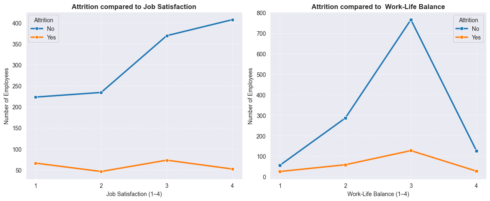

# 📊 Employee Attrition Analysis

---

## 🔗 Live Dashboard
👉 [View Tableau Dashboard](https://public.tableau.com/views/Book1_17572540423340/ATTRITIONDASHBOARD?:language=en-GB&:sid=&:redirect=auth&:display_count=n&:origin=viz_share_link)

---

## 📊 Dashboard Preview

  

## 📌 Overview

This project involves an **Exploratory Data Analysis (EDA)** of an HR dataset to understand the drivers of **employee attrition**. The dataset includes demographic, job-related, compensation, and performance factors.  
The primary goal is to extract **actionable insights** that help HR teams make **data-driven decisions** to improve employee satisfaction, reduce turnover, and strengthen workforce planning.

---

## 📂 Dataset

The dataset consists of employee records with the following key features:

* **Demographics:** Age, Gender, Marital Status, Education  
* **Job Details:** Department, Job Role, Business Travel, Work-Life Balance, Overtime  
* **Compensation:** Salary, Hike %, Years Since Last Promotion, Performance Rating  
* **Tenure:** Years at Company, Years with Current Manager, Years Since Last Promotion  

---

## 🎯 Key Objectives

1. **Attrition Overview** – Measure overall attrition rate and its organizational impact.  
2. **Demographic Factors** – Assess how age, gender, and marital status influence attrition.  
3. **Job-Related Factors** – Examine attrition across departments, roles, and travel requirements.  
4. **Satisfaction Factors** – Evaluate how work-life balance, overtime, and promotions affect retention.  
5. **Compensation & Growth** – Understand the role of income, hikes, and promotions in employee turnover.  
6. **Actionable HR Insights** – Recommend strategies to reduce attrition and retain top talent.  

---

## 📊 Key Visualizations & Insights  

| **Attrition by Age** | **Attrition by Department** |
| :---: | :---: |
|  |  |
| **Young workforce (18–35)** shows the highest attrition, driven by career mobility. Employees above 36 remain significantly more stable. | **Sales (20.6%)** and **HR (19%)** face higher attrition compared to **R&D (13.8%)**, indicating functional hotspots. |

| **Overall Attrition Rate** | **Attrition by Education** |
| :---: | :---: |
|  |  |
| **Overall Attrition is Manageable but Non-trivial** – With a total rate of **16.1%**, about 1 in 6 employees leave. While not alarming, it signals underlying retention challenges.| Employees with **Bachelors & Masters** drive most attrition, while PhDs/Doctors show near-zero exits—stronger retention at higher qualifications. |

| **Attrition by Job Role** | **Attrition by Performance rating** |
| :---: | :---: |
|  |  |
| **Sales Executive (23.9%)**, **Research Scientists (17.5%)**, and **Healthcare Representatives (23.1%)** are most vulnerable. **Managers/Directors (<5%)** show strong loyalty. | **Attrition not performance-driven** – Since attrition percentages are nearly identical, it implies that **factors beyond performance rating** (e.g., compensation, satisfaction, work-life balance) are likely influencing employees’ decision to leave. |

| **Attrition vs Promotions** | **Attrition vs Satisfaction Rating** |
| :---: | :---: |
|  |  |
| **Critical retention window (0–2 years)**:The gap between “Attrition = Yes” and “Attrition = No” is widest in the first 2 years. This is the most **sensitive period** where HR interventions (career growth opportunities, training, salary hikes) can reduce attrition. |  **Satisfaction and work-life balance strongly influence attrition, but they’re not absolute safeguards.** Even employees who report being satisfied sometimes leave, likely due to other factors like growth opportunities, compensation, or job role fit. |

| **Attrition vs Income** | **Attrition vs Travel** |
| :---: | :---: |
|  |  |
| **Employees in **low salary brackets (0–5k)** and those getting **low increments (0–11%)** are the most vulnerable to attrition.* **Higher income and higher raises act as retention drivers.*** HR should **review compensation and raise policies** to ensure lower-income employees and those with low hikes don’t feel undervalued. | **Rare Travelers are the majority** – Most employees fall into the *Travel\_Rarely* group, and although their absolute attrition (156) is highest, their attrition **rate** is moderate (\~15%).**Frequent Travelers face the highest risk** – About **25%** of employees who travel frequently left (69 out of 277). This is the **most vulnerable group**. |

---

## ✅ Conclusion

### 🔑 Key Insights
* **Attrition Rate:** 16.1% overall (≈1 in 6 employees leave).  
* **High-Risk Segments:** Young, single, mid-qualified employees in **Sales/HR/Lab roles**.  
* **Retention Drivers:** Higher pay, fair promotions, career growth, work-life balance.  
* **Organizational Impact:** Targeted interventions in **compensation, promotions, and employee engagement** can significantly reduce attrition.  

### 📌 Strategic Recommendations
1. **Boost Career Growth** – Transparent promotion pathways and mentorship programs.  
2. **Fair Compensation** – Salary adjustments and performance-based increments.  
3. **Work-Life Balance** – Limit excessive overtime and support frequent travelers.  
4. **Retention Focus** – Prioritize Sales & HR functions and younger employees.  

---

## 📌 Tech Stack
* **Language:** Python , MySQL  
* **Libraries:** Pandas, Matplotlib, Seaborn , PyMySQL , SQLAlchemy  
* **Tools:** Jupyter Notebook, Tableau Public  

---

✨ *This analysis provides HR leaders with actionable insights into workforce retention and attrition drivers, empowering organizations to build a more stable and engaged workforce.*  
